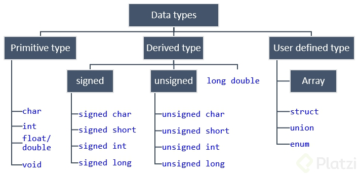

# CURSO DE INTRODUCCION A C

## INTRODUCCION

C es un lenguaje de programación de sistemas, lo que significa que esta muy cerca de los lenguajes de bajo nivel. Una ventajas que ofrece C es la posibilidad de aumentar la eficiencia de las implementaciones de tu código.

Material bibliográfico para acompañar la cursada:
- The C Programming Language (Brian Kernighan and Dennis Ritchie)
- C how to program (Harvey Deitel and Paul Deitel)

## ¿QUÉ ES EL LENGUAJE C?

El lenguaje C es un tipo de lenguaje estructurado. Se ocupan en software de aplicacion, drivers, computadoras para realizar operaciones matematicas super veloces y en sistemas embebidos.

Fue creado por Denis Ritchie quien lo desarrollo en los años 1972 y 1973, lo que queria es hacer un lenguaje mas comprendible. C es un lenguaje Compilado asi tambien es un lenguaje de Nivel Intermedio

## ¿CÓMO FUNCIONAN LAS COMPUTADORAS?

El profesor Ricardo Celis nos cuenta la historia y evolución de las computadoras, cómo funcionan y cómo pueden procesar información con el sistema binario para entender los documentos, textos, vídeos, imágenes, sonidos o algoritmos que vamos a programar para agilizar nuestro trabajo de todos los días.

Las computadoras nos ayudan a trabajar con mayor velocidad y eficiencia porque pueden generar un resultado para resolver nuestras operaciones a partir de un conjunto de instrucciones previamente definidas. Además, así como en las películas, las computadoras tienen millones de dispositivos electrónicos que conocemos como transistores y se encargan de convertir la electricidad en bits: el sistema binario de ceros y unos, la menor expresión de información de las computadoras.

Las computadoras nacen de la necesidad de hacer nuestra vida mas fácil
En un principio las computadoras nos ayudaban a trabajar con números mas fácil
Hoy en día las computadoras nos han ayudado a muchas mas cosas
Dentro de una computadora todo funciona con Binario

Transistores almacenan 0 y 1 (Bits)
Los cables dentro de un circuito llevan la informacion de un lado a otro
La base que se utiliza para mostrar todo en una computadora es Binario

El software son las series de instrucciones para que esta pueda hacer los procesos

El flujo que todo programa va a seguir: El input, CPU, memoria, Resultado final

 
[========]

## ¿POR QUÉ APRENDER C?

- Ayuda a entender los fundamentos de teoria de la computacion
- Escribir mucho porque tiene muy pocas librerias
- El mas utilizado en programacion de circuitos embebidos
- Muy rapido en tiempo de ejecucion 

 
[========]

## INSTALANDO C EN WINDOWS

Descargar un IDE de C/C++ (Integrated Development Environment).Estos software incluyen todo lo necesario para editar y ejecutar un programa de C o C++, incluyendo el editor de texto, el compilador, y una consola para ejecutar los programas y ver los resultados. La ventaja es que no necesitan configurar variables de entorno ni descargar ningún otro software. Mi recomendación es usar Codeblocks. Es muy completo, estable, fácil de instalar y es gratuito.
[CodeBlocks](https://sourceforge.net/projects/codeblocks/files/Binaries/20.03/Windows/codeblocks-20.03-setup.exe/download "CodeBlocks")

Otra alternativa razonable es usar editores y compiladores de C online. No necesitan descargar nada. Sólo ingresan a la página que elijan,editan su programa, lo ejecutan, y obtendrán los resultados en una consola auxiliar que proporciona la misma página.
Mi recomendación: [C Online](https://www.onlinegdb.com/online_c_compiler "C Online")

Otra alternativa si tienes instalado el Visual Studio Code en tu computadora es seguir el siguiente [tutorial](https://platzi.com/tutoriales/1469-algoritmos/2765-compilando-cc-desde-visual-studio-code-windows-10/ "tutorial") para que corras C en tu maquina

 
[========]

## ESTRUCTURA DE UN PROGRAMA C

C consta de:

1. Directivas de Pre-Compilador (librerías)
2. Función main
3. Código dentro de la función main
4. Finalizacion de la función main (return)

 
[========]

## TIPO DE DATOS EN C
Aritmeticos:

(A) Valores enteros:

int: 2 o 4 Bytes permite tener numeros negativos y positivos

2 Bytes -32,768 to 32,757

4 bytes -2,147,483,648 to 2,147,483

unsigned int 2 o 4 bytes no nos permite tener datos negativos

2 Bytes 0 to 65.535

4 bytes 0 to 4,294,967,295

short 2 Bytes

2 Bytes -32,768 to 32,767
unsigned short 2 Bytes 0 yo 65,535

long 8 Bytes

long 8 bytes -9223372036854775808 to 9223372036854775807

unsigned long 8 Bytes 0 to 18446744073709551615

(B) De punto FLorante:

float 4 Bytes 1.2E-38 to 3.4E+386 ( 6 decimal places)
double 8 Bytes 2.3E-308 to1.7E+30815 (15 decimal places)
long double 10 Bytes 3.4E-4932 to 1.1E+493219 (19 decimal places)

[Referencia](https://codeforwin.org/2017/08/data-types-in-c-programming.html "Referencia")

 
[========]

## TIPO DE DATO VOID

Void : Especifica que no hay valor disponible y se usa en 3 escenarios

1. Funcion retorna un tipo de datos void 
	Void Function()
3. Funcion tiene argumentos de tipo void
	Int random(void)
5.  Puntero o apuntador que va a la direccion en memoria de un objeto pero no le importa el tipo de dato que tenga

 
[========]

## TIPO DE DATO ENUM

enum: guarda valores constantes en una lista, aunque puede incluir variables.

El tipo de datos Enum sirve para nombrar o identificar un determinado valor (usar un nombre que tengan algún sentido para el programador) , y así facilitar la lectura y mantenimiento del programa. En otras palabras es un apodo que se le da a un valor numérico, el cual tiene un sentido para el programador dentro del contexto del programa."

"Los nombres o identificadores asignados dentro del enum, únicamente podrán ser cadenas de caracter que no empiecen por valores numéricos. (Tiene las mismas restricciones que los nombres de las variables). Si intenta asignar como identificador un valor numérico (int, float, double) o una cadena de caracteres que empiece por un número (por ejemplo 45a), el compilador arrojará un error. En este sentido, un nombre o identificador actuaría más como el nombre de una variable que como una variable de tipo string en si misma. "

“Nota: recuerde que el tipo de datos string no existe en C.”

 
[========]

## TIPO DE DATO CHAR

El tipo de datos char almacena caracteres.
Rango:
- char 1 Byte -128 to 127
- unsigned char 1 Byte 0 to 255

 
[========]

## DECLARACIÓN DE VARIABLES

%d Se utiliza para representar una parte de la memoria como un número entero.

Placeholders usados en C

- %c - a character

- %s - a string

- %d - a decimal integer

- %o - an octal integer

- %x - a hexadecimal integer

- %p - an address (pointer)

- %f - for floats

- %e - a floating point number in scientific notation

- %E - a floating point number in scientific notation

- %% - The % symbol

 
[========]

## DECLARACIÓN AVANZADA DE VARIABLES

Una variable es un espacio de memoria reservado (en RAM), cuyo tamaño depende del tipo de dato que se quiere almacenar. A dicho espacio reservado podemos asignarle un nombre, para referirnos mucho más fácil a la dirección de memoria donde se encuentra, o al valor que almacena. Los datos contenidos en una variable, al estar cargados en la memoria RAM, desaparecerán una vez el computador se apague.

Debido a que C es un lenguaje fuertemente tipado, es necesario declarar el tipo de datos que va a contener una variable desde el momento de la declaración. La sintaxis (forma correcta de escribir en un lenguaje) para declarar una variable en C es la siguiente

`char letra;`

donde char representa el tipo de datos (caracter), letra es el nombre que le asignamos a la variable, y el ; representa el final de la instrucción. En este ejemplo, hemos reservado 1 byte para almacenar nuestros datos, sin embargo, no se le ha asignado ningún valor aún. Si quisiéramos declarar una variable e inmediatamente guardar un dato en ella podríamos hacerlo usando la sintaxis:

`char letra='a';`

a será el valor que almacena la variable, y se encuentra entre comillas sencillas para indicar que es un caracter.

Finalmente cabe aclarar que podemos asignar cualquier nombre a una variable, teniendo en cuenta estas restricciones:

No debe empezar por un número

No debe ser igual a una palabra reservada del sistema, es decir, palabras definidas previamente por el lenguaje para ejecutar acciones especiales
Deben ser significativos, es decir, que describan claramente lo que están almacenando. Ej. Para almacenar la cantidad de estudiantes de un curso, podriamos llamar a la variable alumnos

 
[========]

## DECLARACIÓN DE CONSTANTES

Como su nombre lo indica, una constante es un valor que no va a cambiar durante toda la ejecución del programa. Al igual que una variable, una constante reserva una cantidad de memoria (que dependen del tipo de dato que almacena), y le asigna un valor, el cual será considerado en adelante como una variable de sólo lectura. Es decir, solo podremos acceder a esa posición de memoria a recuperar el valor que contiene , pero no tenemos la posibilidad de modificar dicho valor

 
[========]

## PREPROCESSOR DIRECTIVES: DEFINE

Una directiva de preprocesador es una instrucción que recibe el compilador y le indica que hay ciertas acciones a realizar antes de iniciar a compilar el programa. Se insertan al principio de cada programa, y se identifican por estar precedidas por el caracter # (Hastag)

Una de las más conocidas es la directiva include, que le dice al compilador que debe incluir una librearía (código previamente escrito, con alguna funcionalidad extra que puede ser usada de manera general en muchos programas) y hacerla parte del código actual.

Otras directivas de prerpocesador son #ifdef, #ifndef, #else, #elif y #endif las cuales sirven como condiciones para evitar errores, al definir varias veces las mismas variables.

 
[========]

